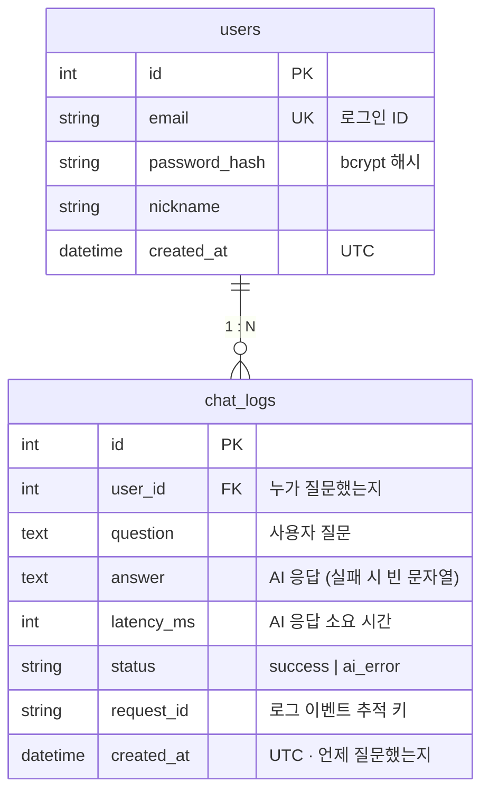

# 🤖 AI Chatbot Service

웹 기반 AI 챗봇 서비스 — FastAPI + SQLite. 로그인한 사용자의 질문을 AI API로 전달해 응답하고,
처리한 채팅과 AI 오류에 대해 사용자별 대화 로그 저장을 시도합니다. DB 저장에 실패하면 대화가 기록되지 않을 수 있습니다.

[](https://github.com/codyssey-term-mission-B7-1/ai-chatbot-service/actions/workflows/ci.yml)
[](https://github.com/codyssey-term-mission-B7-1/ai-chatbot-service/actions/workflows/cd.yml)

## 0. 문서 맵

| 문서 | 내용 |
|------|------|
| **[docs/API.md](docs/API.md)** | API 명세 — 요청/응답 예시, 오류 코드, curl 시나리오 |
| **[docs/TODO.md](docs/TODO.md)** | 역할별 TODO 리스트 (카드 01~13 ↔ 이슈 #1~#13) |
| **[docs/ACCESS_CONTROL.md](docs/ACCESS_CONTROL.md)** | 접근 제어 매트릭스 (경로 × 인증 상태) |
| **[docs/BACKUP_RESTORE.md](docs/BACKUP_RESTORE.md)** | DB 백업·복원 정책 (RPO/RTO, `scripts/backup_db.sh`) |
| **[docs/OBFUSCATION.md](docs/OBFUSCATION.md)** | 난독화·코드 보호 정책 (미적용 결정 + 대체 전략) |
| **[docs/VOLUME_MANAGEMENT.md](docs/VOLUME_MANAGEMENT.md)** | 볼륨·디스크 관리 정책 (배포 시 영구 볼륨 필수) |
| **[docs/git-rules.md](docs/git-rules.md)** | Git 형상관리 규칙 적용 증빙 (룰셋·Squash 금지·민감정보 차단) |
| **[docs/commit-audit.md](docs/commit-audit.md)** | 주간 커밋/PR 감사 — 팀원별 커밋 10회+ 요구사항 추적 |
| **[docs/DEMO_CONTEXT.md](docs/DEMO_CONTEXT.md)** | 문맥 유지 시연 증빙 + `CONTEXT_TURNS` 값 실험 결과 |
| **CONTRIBUTING.md** | 컨벤션 — 브랜치/커밋/PR/리뷰/로그 규칙 |
| **Swagger UI** | 서버 실행 후 `/docs` (대화형 API 문서) · `/redoc` |

## 1. 프로젝트 개요

| 항목 | 내용 |
|------|------|
| 문제 정의 | 흩어진 기술(리눅스/웹/DB/AI API)을 하나의 서비스로 통합한 경험 부족 |
| 타겟 사용자 | 회원가입 후 개인 질의응답을 주고받으며 자신의 대화 기록을 추적하고 싶은 사용자 |
| 핵심 시나리오 | ① 회원가입/로그인 → ② 질문 입력 → ③ AI 응답 즉시 표시 → ④ "내가 방금 뭘 물어봤지?"에 직전 대화를 인용한 문맥 응답 → ⑤ 내 기록 페이지에서 대화 로그 확인 |

## 2. 시스템 구조

```
브라우저 (Jinja2 템플릿 + Vanilla JS fetch)
   │  JSON (세션 쿠키)
   ▼
FastAPI (app/main.py)
   ├─ routers/auth.py    회원가입·로그인·로그아웃 (bcrypt + 세션 쿠키)
   ├─ routers/chat.py    질문 수신 → AI 응답 수신 → 로그 저장 시도 → 사용자에게 응답 반환  ★핵심 파이프라인
   ├─ routers/pages.py   HTML 페이지 (/, /login, /signup, /logs)
   ├─ deps.py            get_current_user — 비로그인 401 접근 제어
   ├─ services/ai_client.py  AI API 호출 (타임아웃·재시도·에러 매핑, 키는 서버의 .env/환경변수에서만)
   ├─ services/context.py    문맥 유지 — 직전 N개 Q/A를 프롬프트에 포함
   └─ logging_config.py  로그 유틸리티 — 표준 등록 목록은 CONTRIBUTING §1.5, 실제 호출 위치는 라우트·AI 클라이언트 참조
   ▼
SQLite (SQLAlchemy) — users, chat_logs
```

## 3. API 명세

| 메서드 | 경로 | 인증 | 설명 |
|--------|------|:---:|------|
| POST | `/api/auth/signup` | ✕ | 회원가입 (201 / 409 중복 / 422 검증실패) |
| POST | `/api/auth/login` | ✕ | 로그인 — 세션 쿠키 발급 (200 / 401) |
| POST | `/api/auth/logout` | ✕ | 로그아웃 |
| GET | `/api/auth/me` | ○ | 내 정보 |
| POST | `/api/chat` | ○ | 질문 → AI 응답 (200 / 401 / 422 / 502 / 504) |
| GET | `/api/me/chats?limit=50` | ○ | 내 대화 로그 조회 |
| GET | `/health` | ✕ | 헬스체크 |

**요청/응답 예시**

```bash
# 채팅 (로그인 상태에서)
curl -X POST https://SERVER/api/chat -H 'Content-Type: application/json' \
     -b cookies.txt -d '{"question": "내가 방금 뭘 물어봤지?"}'

# → 200
{"answer":"직전에 '배포 방법'을 물어보셨고…","latency_ms":1240,"chat_id":987,"status":"success"}

# 타임아웃 발생 시
# → 504 {"detail":"현재 응답이 지연되고 있어요. 잠시 후 다시 시도해 주세요. (error: AI_TIMEOUT)"}
```

## 4. DB 구조 (ERD)



| 테이블 | 필드 | 설명 |
|--------|------|------|
| `users` | id (PK), email (UNIQUE), password_hash, nickname, created_at | 계정 |
| `chat_logs` | id (PK), **user_id (FK)**, question, answer, latency_ms, status, request_id, **created_at** | 대화 로그 — 최소 추적 필드(사용자 식별/시각/질문/응답) 포함 |

- `status`: `success` | `ai_error` (타임아웃 등 실패도 추적 대상으로 기록)
- 시각 필드는 모두 **UTC** (`created_at`)
- 인덱스: `chat_logs.user_id`, `chat_logs.created_at` — 사용자별 조회(`GET /api/me/chats`)와 시각순 정렬용
- 사용자 삭제 시 대화 로그도 함께 삭제 (`cascade="all, delete-orphan"`)

## 5. 실행 방법

```bash
python -m venv .venv && source .venv/bin/activate   # Windows: .venv\Scripts\activate
pip install -r requirements.txt

cp .env.example .env        # 값을 채워넣기 (AI_API_KEY 없으면 데모 모드)
uvicorn app.main:app --reload --host 0.0.0.0 --port 8000
# → http://localhost:8000
```

### 환경변수 (실제 비밀값은 개인 .env 또는 프로세스 환경변수로 주입)
`AI_API_KEY` · `AI_BASE_URL` · `AI_MODEL` · `AI_TIMEOUT_SEC` · `AI_MAX_RETRIES` · `CONTEXT_TURNS` · `DATABASE_URL` · `SESSION_SECRET` — 상세 설명은 `.env.example` 참고

### AI 제공사 교체하기 (코디세이 '네이토' 등 OpenAI 호환)

이 서비스의 AI 호출부는 **OpenAI 호환 chat completions 표준**으로 구현돼 있어서
코디세이 네이토처럼 OpenAI 형식을 따르는 API라면 **코드 수정 없이 .env 3줄**로 연결됩니다:

```env
AI_API_KEY=코디세이에서발급받은키
AI_BASE_URL=https://(코디세이-호스트)/v1     # 전체 URL 또는 /v1까지 (/chat/completions는 자동 추가)
AI_MODEL=(네이토 모델명)
```

- **연결 확인**: `python scripts/ai_check.py` — 설정 출력 + 실제 호출 1회 (성공/타임아웃/실패 원인 안내)
- **키 받기 전 로컬 검증**: `python scripts/mock_openai_server.py` 로 목업(8001)을 띄우고
  `AI_API_KEY=mock-key`, `AI_BASE_URL=http://127.0.0.1:8001/v1`, `AI_TIMEOUT_SEC=1`로 로컬 테스트 — 질문에 "천천히"를 포함하면 목업의 30초 지연보다 먼저 타임아웃(504)이 발생합니다. 테스트 후 설정을 원복하세요.

## 6. 운영 — 로그 이벤트 / 오류 처리 / 입력 검증

**핵심 로그 예시 6종** (전체 이벤트 목록이 아님) (`event=` 으로 grep):
```
request_received  user_id=12 path=/api/chat        # 요청 수신 (미들웨어)
ai_call_start     user_id=12 request_id=abc123     # AI 호출 시작
ai_call_success   request_id=abc123 latency_ms=1240
ai_call_fail      request_id=abc123 reason=timeout # 타임아웃/실패 (ERROR 레벨)
db_save_success   user_id=12 chat_id=987           # DB 저장 성공/실패
db_save_fail      user_id=12 reason=db_exception
```

**오류 처리**: AI 타임아웃 → 504 `AI_TIMEOUT` 안내 / AI 오류 → 502 `AI_ERROR` / 미처리 예외 → 전역 핸들러가 500 안내 (서버 비정상 종료 없음) — `tests/integration/test_chat_flow.py::test_timeout_returns_504_and_server_survives`로 검증

**입력 검증**: 빈 질문/공백 차단 + 서버 `MAX_QUESTION_LENGTH` 제한(기본 1000자). 현재 프론트 제한은 별도 1000자이므로 설정 변경 시 양쪽을 함께 확인합니다. 회원가입은 비밀번호 8자 이상·이메일 형식을 검증합니다.

## 7. 테스트 · CI/CD

```bash
pip install -r requirements-dev.txt
pytest --cov=app --cov-report=term-missing   # 유닛 + 통합 전체
ruff check app tests                          # 린트
```

| 분류 | 파일 | 커버 요구사항 |
|------|------|----------------|
| 유닛 | `tests/unit/test_schemas.py` | 입력 검증 |
| 유닛 | `tests/unit/test_context.py` | 컨텍스트 전략 |
| 유닛 | `tests/unit/test_ai_client.py` | 엔드포인트 정규화·타임아웃/에러 매핑 |
| 통합 | `tests/integration/test_auth_flow.py` | 인증 + 접근 제어 |
| 통합 | `tests/integration/test_chat_flow.py` | 파이프라인·타임아웃 생존·문맥·사용자 격리 |

**CI** (`.github/workflows/ci.yml`): PR/develop 푸시 시 → ruff + pytest 자동 실행 (실 AI 키 불필요 — Fake 제공자 사용)
**CD** (`.github/workflows/cd.yml`): main 병합 시 → 테스트 게이트 → Secrets 동기화 → Railway 배포 → E2E 스모크. 필수 Secrets(`RAILWAY_TOKEN`·`DEPLOY_URL`·`SESSION_SECRET`) 등록 시 활성화 — 상세 [docs/RAILWAY_DEPLOY.md](docs/RAILWAY_DEPLOY.md)

## 7-1. 목데이터 / 목업 드라이버

| 도구 | 용도 | 사용법 |
|------|------|--------|
| `scripts/seed_mock_data.py` | 평가/데모용 계정+대화 로그 생성 | `python scripts/seed_mock_data.py` (계정: `demo@demo.com` / `Test1234!`) |
| `scripts/mock_openai_server.py` | 네이토(OpenAI 호환) 목업 서버 — 실제 키 없이 E2E 검증 | 실행 후 로컬 `.env`에 `AI_API_KEY=mock-key`, `AI_BASE_URL=http://127.0.0.1:8001/v1` 설정 |
| `app/services/ai_client.py` 내 `FakeAIProvider` | 테스트용 목 드라이버 (AI_API_KEY 미설정 시 자동 적용) | 별도 설정 불필요 |
| 질문에 "천천히" 포함 | 목업 30초 지연 → `AI_API_KEY=mock-key` 및 `AI_TIMEOUT_SEC=1` 등 30초보다 짧은 제한을 설정한 로컬 테스트에서 504 재현 | `{"question": "천천히 답해줘"}` |

## 8. DB 확인 가이드

```bash
# 방법 1) 확인용 SQL 스크립트
sqlite3 app.db < scripts/check_logs.sql

# 방법 2) 로그 조회 API (내 로그)
curl -b cookies.txt https://SERVER/api/me/chats
```

실서버 검증은 `scripts/e2e_smoke.sh https://SERVER` (가입→로그인→비로그인 401 확인→채팅→로그 조회 전 과정 자동 점검)

## 9. 배포 (Railway + GitHub Actions)

- 파이프라인: `main` 머지 → CI 게이트 → Secrets 동기화 → Railway 배포 → `/health` 폴링 → 스모크
- 환경변수 source of truth: **GitHub Secrets** (키·엔드포인트 전부, 값은 저장소에 없음)
- DB 영속화: Railway Volume을 `/data`에 마운트 + `DATABASE_URL=sqlite:////data/app.db` → 재배포해도 초기화 안 됨
- 상세 절차: [docs/RAILWAY_DEPLOY.md](docs/RAILWAY_DEPLOY.md)

## 10. 팀 협업

- 브랜치: `main ← develop ← feature/#이슈번호-설명` · PR 리뷰어 1명 승인 후 머지 (Squash 금지)
- 커밋: `type(scope): 제목 (#이슈번호)` — 상세 규칙은 팀 문서(CONTRIBUTING.md) 참고
- 역할 카드 13장은 GitHub Issues에서 관리 — 각자 3개 셀프어사인
- **[TODO: 팀 구성원 역할 및 개인별 작업 요약 — D10에 작성]**
