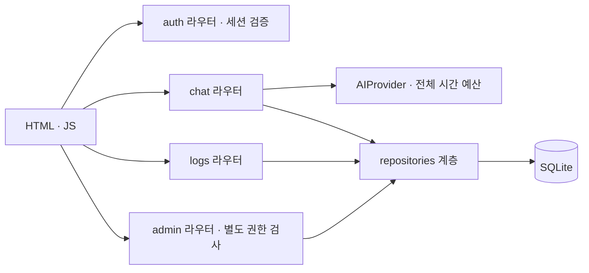
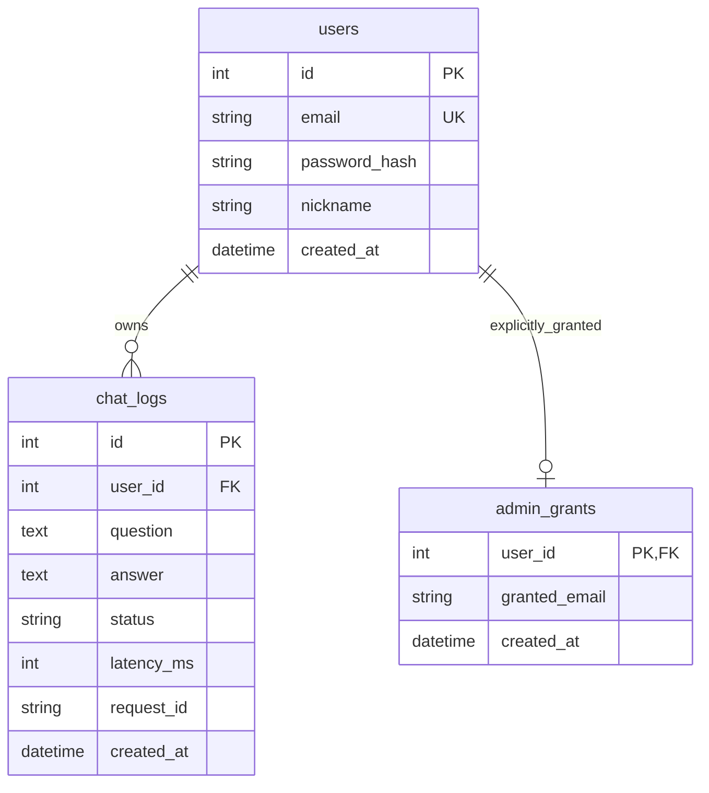

# AI Chatbot Service

FastAPI + SQLite 기반의 로그인형 AI 챗봇입니다. **현재 소스에는 실제 앱·UI·테스트가 포함되어 있습니다.** 대화별 저장·개인 문맥·관리자 조회를 제공하며, 실제 외부 AI와 배포 성공은 별도로 검증해야 합니다.

[](https://github.com/codyssey-term-mission-B7-1/ai-chatbot-service/actions/workflows/ci.yml)
[](https://github.com/codyssey-term-mission-B7-1/ai-chatbot-service/actions/workflows/cd.yml)

> **운영 URL: https://ai-chatbot-service-production-4aa1.up.railway.app** — 2026-09-09 CD 전 구간 통과(게이트 → Secrets 검증 → 변수 동기화 → railway up → /health → E2E 스모크 7/7, [실행 기록](https://github.com/codyssey-term-mission-B7-1/ai-chatbot-service/actions/runs/34324577000)). 현재 `ai_mode=demo`(실 AI 키 미등록)이며 `AI_API_KEY` Secret 등록 후 재배포 시 `real`로 전환됩니다. 로컬/Fake/모의 HTTP 테스트와 운영 배포·실 AI 성공을 혼동하지 않습니다.

## 1. 문제·사용자·시나리오

| 항목 | 내용 |
|---|---|
| 문제 | 질문·답변이 흩어지면 이전 대화의 맥락과 개인 기록을 다시 확인하기 어렵다. |
| 대상 | 계정별 질의응답·자신의 대화 기록을 추적하려는 사용자 |
| 핵심 흐름 | 가입 → 로그인 → 질문 → AI 응답 → 성공 대화 문맥 유지 → 본인 기록 조회 |
| 운영자 흐름 | 명시적 앱 관리자 권한을 부여받은 계정만 전체 기록 조회·필터 가능 |
| 한계 | 실제 AI 키가 없으면 Fake 데모. 계정별 rate limit·요금 상한·중앙 세션 폐기는 별도 미구현 |

## 2. 구조와 실제 파일



| 책임 | 파일 |
|---|---|
| 앱·미들웨어·오류 헤더 | `app/main.py` |
| 인증·관리자 의존성 | `app/deps.py`, `app/services/security.py`, `app/services/admin.py` |
| 목적별 라우트 | `app/routers/auth.py`, `chat.py`, `logs.py`, `admin.py`, `pages.py` |
| DB·모델·CRUD | `app/database.py`, `app/models.py`, `app/repositories/` |
| 입력·응답 계약 | `app/schemas.py`, `app/policies.py` |
| 서버 AI 호출·문맥 | `app/services/ai_client.py`, `context.py` |
| 회원가입/로그인 UI | `/signup`, `/login` → `templates/login.html`, `static/js/auth.js` |
| 채팅/기록/관리자 UI | `templates/chat.html`, `logs.html`, `admin-logs.html`, `static/js/chat.js` |

처리 순서는 **입력 검증 → 같은 사용자의 성공 Q/A → AI 응답 수신 → DB 저장 시도 → HTTP 응답**입니다. DB 저장 실패 시 `status=success`라도 `chat_id=-1`일 수 있습니다.

## 3. 로컬 실행

```bash
python -m venv .venv
source .venv/bin/activate  # Windows: .venv\Scripts\activate
pip install -r requirements.txt
cp .env.example .env
uvicorn app.main:app --host 0.0.0.0 --port 8000 --reload
```

접속: `http://localhost:8000`. `.env.example`의 `DEBUG=true`는 로컬 전용입니다. 실제 AI 키가 없어도 데모는 동작하지만 실 AI 연결 성공을 뜻하지 않습니다. 환경변수를 변경하면 앱 프로세스를 재시작해야 합니다.

운영에서는 `DEBUG=false`와 새로 생성한 32자 이상 무작위 `SESSION_SECRET`이 필요합니다. 값은 GitHub/배포 플랫폼의 비밀변수로 관리하고 저장소에 넣지 않습니다.

## 4. API·인증

상세 요청/응답: **[docs/API.md](docs/API.md)**. `DOCS_ENABLED=true`인 개발·검증 환경에서 실행 중 `/docs`, `/redoc`, `/openapi.json`의 대화형 명세를 확인할 수 있습니다(운영 CD는 기본 `false`로 동기화).

| 메서드 | 경로 | 접근 |
|---|---|---|
| POST | `/api/auth/signup` | 공개, 201 / 중복 409 / 검증 422 |
| POST | `/api/auth/login` | 성공 200 + 서명된 세션 쿠키 / 반복 실패 잠금 429 |
| POST | `/api/auth/logout` | 비로그인도 200, 현재 쿠키 비움 |
| GET | `/api/auth/me` | 로그인 필요 |
| POST | `/api/chat` | 로그인 필요, 200 / 422 / 429 / 502 / 504 |
| GET | `/api/me/chats` | 본인 기록만, 성공 필터·커서 지원 |
| GET | `/api/admin/chats` | 명시적 앱 관리자만 |
| GET | `/health` | 기동/버전/제공자 선택 모드; AI 연결 검증 아님 |

JWT가 아니라 `SessionMiddleware`의 서명 쿠키입니다. 로그인은 이메일별 실패 누적 잠금(`LOGIN_MAX_FAILS`회/`LOGIN_LOCKOUT_SEC`초, 기본 5회/15분, 429+`Retry-After`)이 적용되고, 미가입 이메일에도 동일한 bcrypt 연산을 수행해 이메일 열거 타이밍을 차단합니다. 내용은 `user_id`와 `email_fp`이며 쿠키 서명은 암호화가 아닙니다. HttpOnly·SameSite=Lax·`SESSION_MAX_AGE_HOURS` Max-Age(기본 24시간), 운영 Secure를 사용합니다. 세션에는 발급 시각(iat)이 들어가 `scripts/revoke_sessions.py --email`로 계정별 기존 세션을 서버 측에서 폐기할 수 있습니다. [접근 제어](docs/ACCESS_CONTROL.md)

관리자 권한은 기본적으로 없고 GitHub 역할이나 닉네임으로 생기지 않습니다. 전용 계정을 만든 뒤 **신뢰된 서버 운영자**가 `scripts/manage_admin.py`로 부여합니다. [관리자 운영](docs/ADMIN.md)

## 5. 입력·문맥·오류 계약

- 문자 수는 Unicode **코드 포인트** 기준. 질문 상한은 서버 설정 `MAX_QUESTION_LENGTH`를 화면에도 전달합니다(기본 1000).
- 가입 비밀번호: 8~64 코드 포인트이면서 UTF-8 72바이트 이하. 초과 시 422이며 조용히 잘라 해싱하지 않습니다.
- 닉네임은 최대 20자. 생략하면 이메일 접두어의 앞 20자를 사용합니다.
- 문맥은 같은 사용자의 직전 성공 Q/A `CONTEXT_TURNS`쌍. 0이면 비활성화, 최대 200.
- UI는 `status=success&limit=N`을 사용해 AI와 같은 범위를 복원합니다. 실패 로그 50건 뒤에도 성공 문맥을 잃지 않습니다.
- 채팅은 사용자별 분당 상한(`CHAT_RATE_PER_MIN`, 기본 10, 0=비활성)이 있어 초과 시 429+`Retry-After`입니다.
- `AI_TIMEOUT_SEC`(기본 45초)은 **AI 호출 전체 예산**: 연결·읽기·추가 시도·대기 포함, DB/전체 HTTP 시간은 제외.
- 타임아웃은 재시도하지 않습니다. 전송 오류·429·5xx만 최대 `AI_MAX_RETRIES`(기본 1)만큼 추가 시도합니다. 다른 4xx와 잘못된 응답 형식은 즉시 AI_ERROR/502입니다.
- API 비로그인은 401, HTML 보호 화면은 로그인으로 302. 관리자 권한 부족은 403.
- 모든 응답에 `Content-Security-Policy`를 포함한 보안 헤더가 붙고(#75), 상태 변경 요청은 교차 출처 `Origin`을 403으로 차단합니다(Origin이 없는 curl/스모크는 통과).

## 6. DB와 추적



`chat_logs.user_id/created_at`는 인덱스 대상입니다. 시간은 UTC로 저장하고 API는 `Z`를 포함합니다. `latency_ms`는 AI 논리 호출 시간이며 저장 성공을 보장하지 않습니다. `X-Request-ID`와 DB/이벤트의 `request_id`로 연결합니다.

앱 시작의 `create_all`은 없는 테이블만 추가합니다. 기존 열/FK의 마이그레이션이나 데이터 삭제를 하지 않습니다. 새 `admin_grants` 테이블은 기본 비어 있습니다. 오래된 FK 스키마를 바꿀 때는 데이터 보존 계획과 별도 마이그레이션이 필요합니다.

```bash
sqlite3 app.db < scripts/check_logs.sql
# Railway 실제 DB가 /data/app.db인 경우
./scripts/backup_db.sh /data/app.db
```

기본 백업은 **DB 디렉터리의 backups/**입니다. 7세대 보관, 고유 이름, 온라인 백업, 무결성·해시 검증을 제공합니다. [백업/복원](docs/BACKUP_RESTORE.md)

## 7. 테스트와 검증 자료

```bash
pip install -r requirements-dev.txt
ruff check app tests
black --check app tests
isort --check-only app tests
pytest --cov=app --cov-report=term-missing

# 선택: 실제 로컬 브라우저 검증
pip install -r requirements-evidence.txt
python -m playwright install --with-deps chromium
python scripts/capture_local_evidence.py --output artifacts/local-ui
```

- [D01~D19 수정·테스트 연결](docs/VERIFICATION.md)
- [사전평가 31개 항목 증빙](docs/EVALUATION_CHECKLIST.md)
- [브라우저·실행 증빙](docs/evidence/LOCAL_VERIFICATION.md)
- [문맥 실험](docs/DEMO_CONTEXT.md): 실제 12번째 요청의 프롬프트 문자량 측정. 요금·실 AI 품질 실험 아님
- [로그 목적·필드 17종](docs/LOGGING.md): 표준 이벤트 stderr, 원문/시크릿 제외, 값 이스케이프

실 AI 확인은 `python scripts/ai_check.py --require-real`로 별도 수행합니다. 키가 없으면 종료 2이며 **연결 성공으로 처리하지 않습니다**. 모의 OpenAI 서버는 `scripts/mock_openai_server.py`이며 로컬 테스트용입니다.

## 8. 배포 상태와 필요한 외부 작업

Railway CD는 main push 또는 수동 실행에서 테스트 → Secrets 검증 → 변수 동기화 → 배포 → 헬스 → 스모크 순입니다. **필수 Secrets가 없으면 실패로 중단**하며 성공으로 표시하지 않습니다. 2026-09-09 첫 운영 배포에 성공했습니다(위 실행 기록). 시작 명령은 루트 `Procfile`이 제공합니다.

필수: `RAILWAY_TOKEN`, `DEPLOY_URL`, `SESSION_SECRET`. 실제 AI용 `AI_API_KEY`는 별도입니다. GitHub PAT는 Railway 토큰이나 AI 키가 아닙니다.

관리하는 선택 변수의 미설정은 **명시적 기본값/빈 값 적용**입니다. 예전 Railway 값을 조용히 유지하지 않습니다. `AI_API_KEY`가 비면 원격 값도 비우고, `DEBUG=false`를 고정하며 질문 상한도 동기화합니다. 운영 설정에 미치는 영향을 확인한 후 배포하세요. [배포 런북](docs/RAILWAY_DEPLOY.md)

## 9. 역할과 실제 기여

| 계정 | 역할 카드 | 현재 책임 |
|---|---|---|
| giyeop-cody | 01·03·04·05 | PM·서버·인증·접근 제어 |
| Im-Jongseok | 02·07·08 | 형상관리·문맥·DB |
| loader1017 | 06·09·10·11 | AI 연동·UI·로깅·입력 검증 |
| ygyg0605-cloud | 12·13 | 배포·운영·기술 문서·검증 패키지 |

역할표와 CODEOWNERS는 **현재 책임/리뷰 요청 기준**이지 과거 작성자 증명이 아닙니다. 실제 개인별 커밋·PR·리뷰와 M1/M2/M3·회고 기록은 별도로 확인합니다. 기존 기록은 [커밋 감사](docs/commit-audit.md)에 보존합니다.

[열린 작업과 완료 조건](docs/TODO.md) · [팀 컨벤션](CONTRIBUTING.md)
