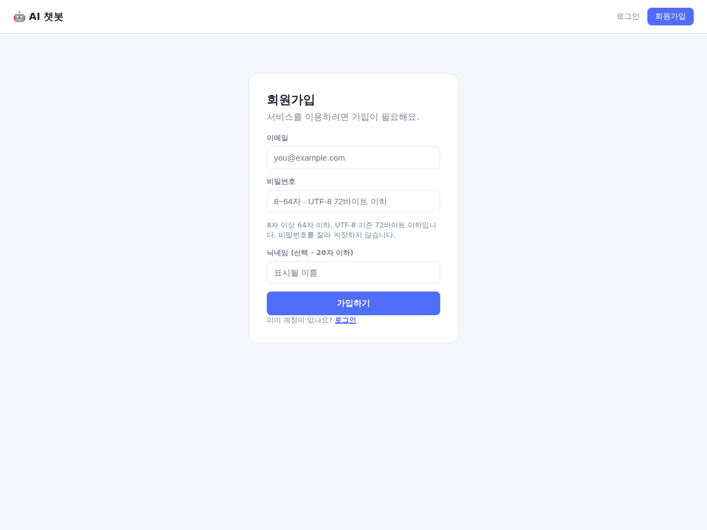
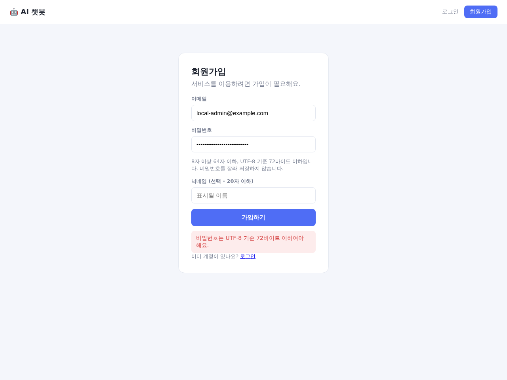
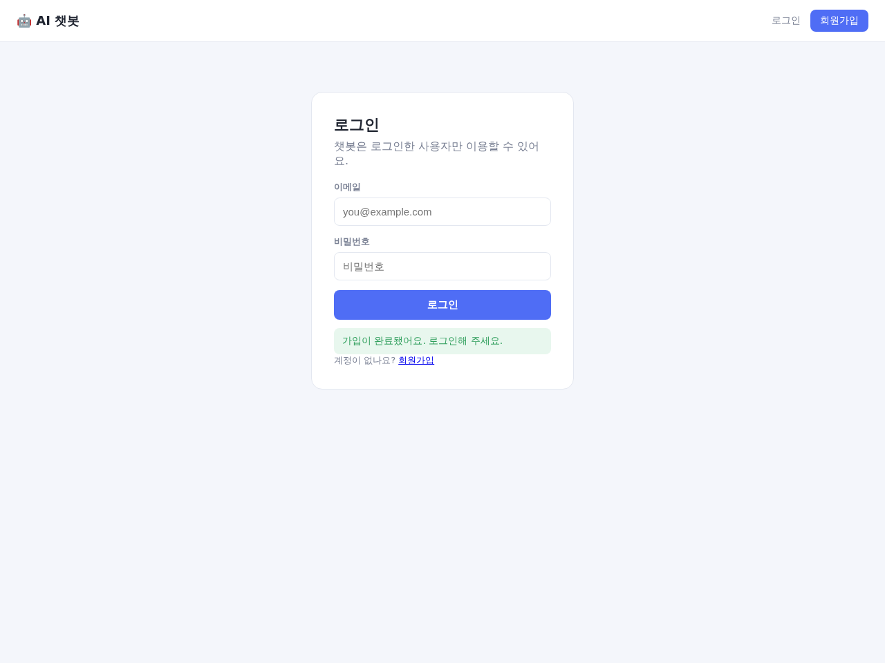
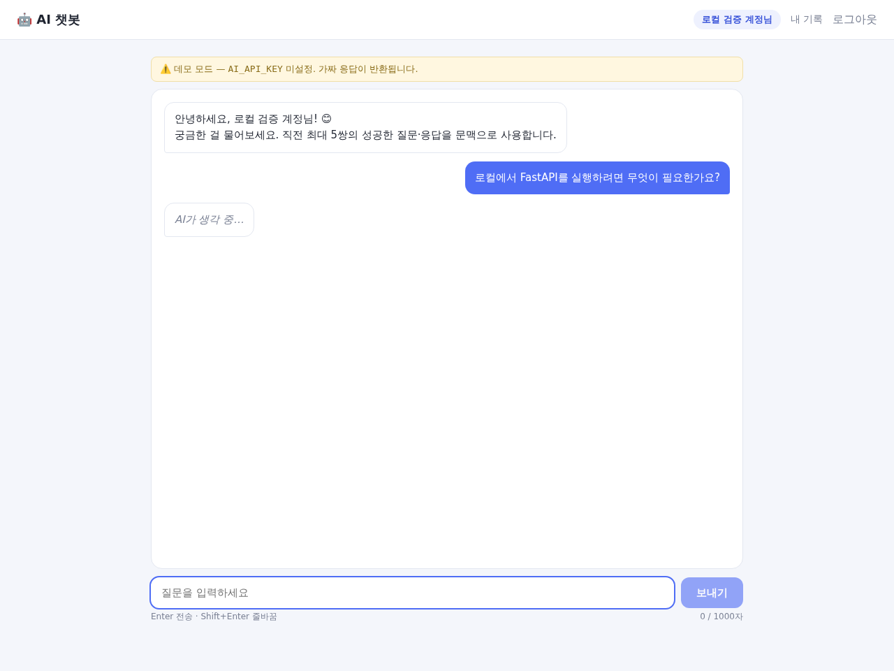
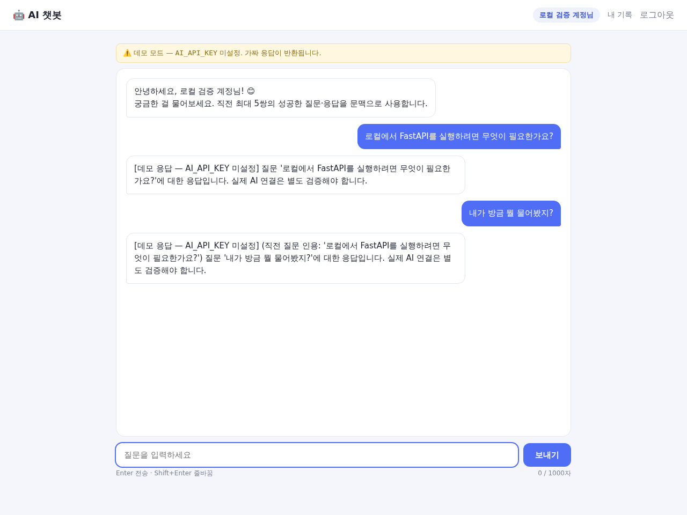
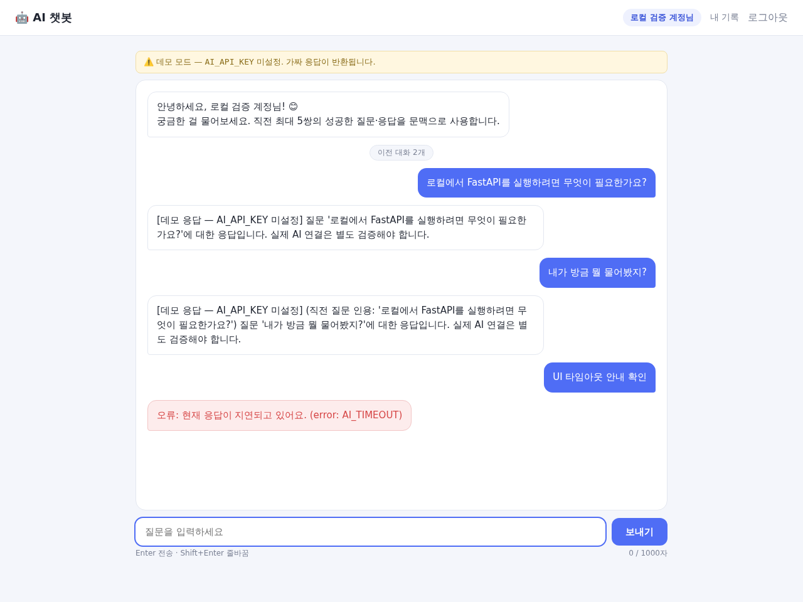
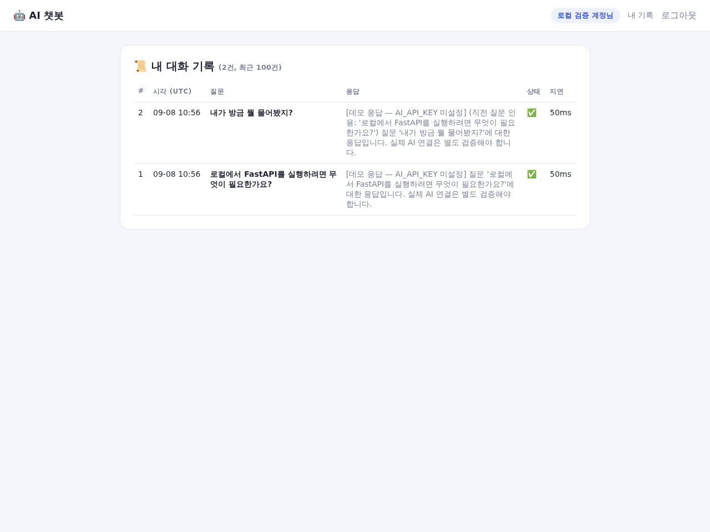
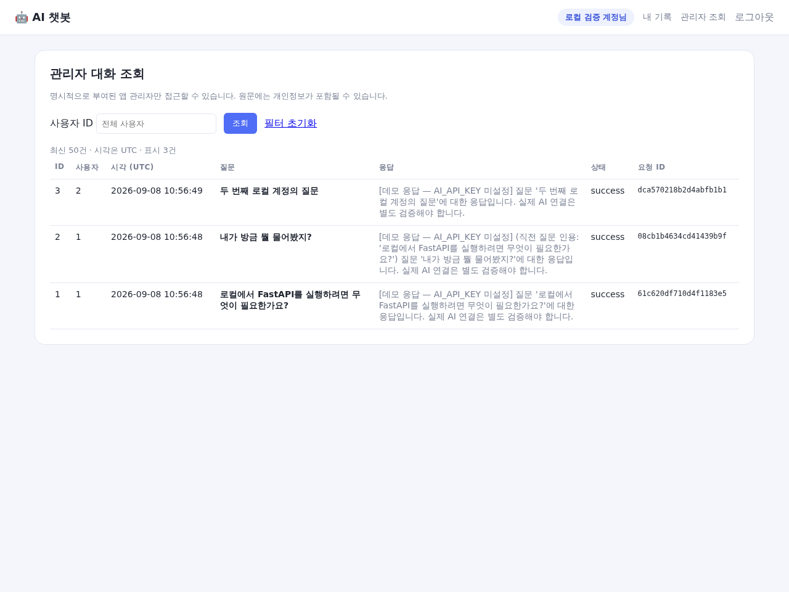
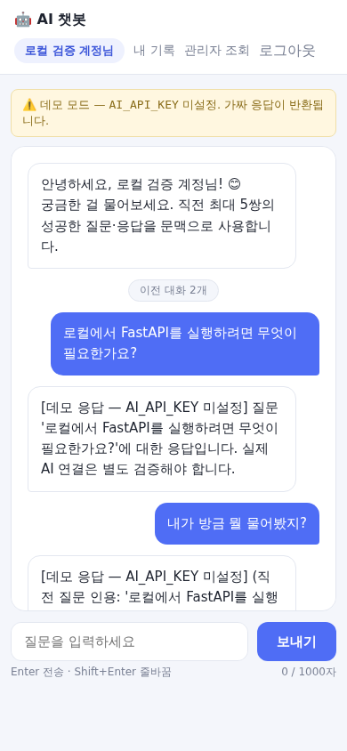

# 로컬 검증 실행 기록

**LOCAL / SYNTHETIC — 운영 배포·실 AI 성공 증거가 아닙니다.**

- 테스트: **119 passed**, 오류/실패 0. 경고 2개는 테스트 클라이언트 의존성의 사용 중단 예정 안내.
- 앱 커버리지: **95.16%** (목표 게이트 85%).
- ruff / Black --check / isort --check-only 통과.
- 실제 Chromium 검증: **14개 시나리오**, 브라우저 pageerror 0.
- 브라우저 실행 시각 UTC: `2026-09-08T10:56:50.007653+00:00`.
- app/templates/static 코드 내용 지문: `5ab8d6a98ecb99329804e2b143ba7e595a3521a8f5604f7593074c86beed6654`.
- 원격 사이트가 아니라 일회성 로컬 Uvicorn 서버·임시 DB·Fake 제공자만 사용했습니다.
- 관리자 캡처는 로컬 운영자 함수로 전용 합성 계정에만 권한을 부여했습니다. 실제 운영 관리자 권한은 부여하지 않았습니다.

## 실행한 UI 시나리오

- [x] UTF-8 비밀번호 바이트 제한 안내
- [x] 가입 → 로그인 → 보호 화면 진입
- [x] 공백/1001 코드 포인트 전송 차단
- [x] 이모지 501개를 501자로 계산
- [x] Shift+Enter 줄바꿈 / 합성 IME 조합 이벤트는 전송하지 않음
- [x] Enter 1회 전송 / 전송 중 중복 요청 방지
- [x] 연속 2질문 문맥 전달/인용 — Fake 모드
- [x] 복귀 시 저장된 성공 대화 복원
- [x] 모의 504 오류 안내·전송 버튼 복구
- [x] 실제 로컬 HTTP로 두 사용자 기록 분리 확인
- [x] 본인 기록 화면·UTC 표기
- [x] 명시적으로 권한 부여한 관리자 조회
- [x] 390px 뷰포트 가로 넘침 없음
- [x] 로그아웃 후 보호 HTML은 로그인 화면으로 이동

## 실제 브라우저 이미지

### 01-signup.png
로컬 실제 회원가입 화면; 실 운영 아님

### 09-password-byte-error.png
한글 25자 비밀번호의 클라이언트 바이트 제한 안내

### 02-login.png
실제 가입 완료 후 로그인 안내; 로컬 합성 계정

### 03-loading.png
네트워크 요청을 1.5초 지연시킨 로컬 로딩 UI

### 04-context-chat.png
내부 Fake 제공자의 문맥 응답; 실 AI 연결 증거 아님

### 05-timeout-ui.png
프론트에 모의 HTTP 504를 주어 오류 표시 검증

### 06-my-logs.png
실제 로컬 DB의 본인 로그; 시각 UTC 표시

### 07-admin-logs.png
로컬 운영자 함수로 명시 부여한 관리자 계정의 실제 조회 화면

### 08-mobile-chat.png
390px 로컬 Chromium 뷰포트; 실기기 검증과 구분

## 자동 테스트 자료

- [JUnit](junit.xml) · [테스트/커버리지 출력](test-results.txt) · [로컬 서버 로그](local-server-log.txt)
- 타임아웃 통합 테스트는 실제 HTTPX와 별도 루프백 HTTP 서버를 사용했습니다. 0.001초/0.15초 예산에서 504와 이후 /health 200을 확인합니다.
- 오류 UI 이미지는 모의 504 응답으로 프론트 표시만 검사한 것이며, 실제 운영 장애 관측이 아닙니다.
- 코드 변경 후 결과를 갱신해야 합니다. 이 기록은 아직 원격 CI 결과를 대신하지 않습니다.
