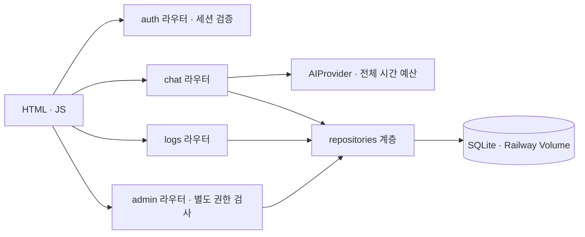
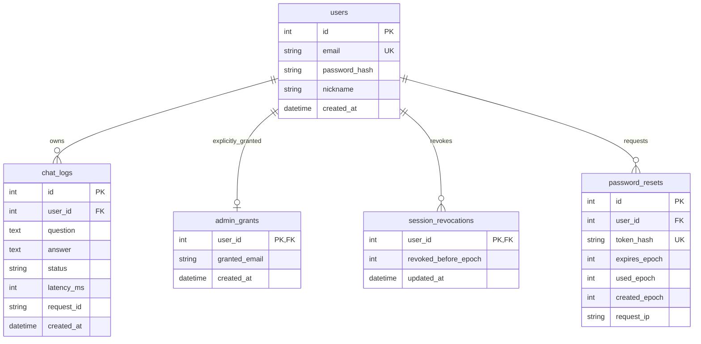

# 05. 아키텍처·데이터 설계

> **문서 이력** | 초안: 2026-09-02 (D4) · v0.2: 2026-09-08 (FK 강제·폐기 테이블 반영) · 최종 갱신: 2026-09-10 (password_resets 테이블 포함)
> **담당**: Im-Jongseok (역할카드 08) · giyeop-cody (카드 03) · loader1017 (카드 11)

---

## 1. 시스템 구성도 (README §2와 동일)

## 2. 계층 책임 (레이어링)

| 계층 | 위치 | 책임 | 금지 |
|---|---|---|---|
| 라우터 | `app/routers/` (auth·chat·logs·admin·pages) | HTTP 진입·응답 계약 | 직접 SQL |
| 서비스 | `app/services/` (ai_client·context·security·sessions·rate_limit·password_reset·admin) | 도메인 로직·외부 I/O | HTTP 객체 직접 반환 |
| 저장소 | `app/repositories/` (users·chat_logs) | 쿼리 집중 | 비즈니스 판단 |
| 계약 | `app/schemas.py` · `app/policies.py` | Pydantic 검증·정책 상수 | 라우터별 하드코딩 |
| 인프라 | `app/database.py` · `logging_config.py` · `config.py` | 세션·로깅·설정 게이트 | — |

## 3. ERD (최종)

**설계 규칙**
- 인덱스: `chat_logs.user_id`, `chat_logs.created_at`, `users.email(UNIQUE)`, `password_resets.token_hash(UNIQUE)`.
- FK는 `ondelete=CASCADE` + **`PRAGMA foreign_keys=ON`** (감사 #51 — ORM 경로만의 cascade는 SQL에서 성립하지 않음 → PR #63으로 강제).
- 시간: 대화·계정은 **UTC datetime**(`Z` 직렬화 계약), 폐기·토큰은 **epoch 초 정수** — SQLite가 tzinfo를 왕복 보존하지 않아 발생하는 naive/aware 비교 오류를 원천 차단(#74 이후 관례).
- 스키마 진화: `create_all`은 없는 테이블만 추가 — `admin_grants`·`session_revocations`·`password_resets`는 **별도 테이블로만** 추가해 기존 열 변경·마이그레이션을 피했다.
- `latency_ms`는 AI 논리 호출 시간이며 저장 성공을 보장하지 않는다(계약 명시).
- `status`: `success | ai_error` — UI 복원·문맥이 이 값을 공유한다.

## 4. 로그·추적 설계

- **표준 이벤트 28종**, stderr 구조화 출력, `event=` 키: `request_received`, `ai_call_start/success/fail`, `db_save_start/success/fail`, `auth_*`, `login_fail`, `login_rate_limited`, `chat_rate_limited`, `auth_password_reset_*`, `admin_user_deleted` 등 (docs/LOGGING.md 집계표).
- **민감정보 규칙**: API 키·비밀번호·질문 원문(50자+) 금지, 이메일은 평문 대신 도메인/지문, 값 이스케이프, 민감 접미사 마스킹 회귀 테스트 4건(#104).
- **추적**: `X-Request-ID` ↔ 이벤트 ↔ `chat_logs.request_id` 3점 연결. 요청 트레이스 3줄(수신→AI→저장)이 한 request_id로 묶인다.
- 로그 이벤트 추가는 CONTRIBUTING §1.5 컨벤션 등록을 PR 체크리스트로 강제(감사 #48 "종수 3중 불일치" 교훈).

## 5. 설정·시크릿 설계

- `pydantic-settings`로 .env 로딩. 모든 선택 변수는 **기본값·단위·허용 범위**를 config에 명시(Field 제약 포함: `session_max_age_hours` 1~168 등).
- **시크릿 게이트**: 운영(DEBUG=false)에서 약한 SESSION_SECRET/PEPPER(공개 예시값·32자 미만)는 `RuntimeError`로 기동 거부, 개발은 경고+임시 키 대체(평가자가 .env.example 복사만으로 기동 가능하게) — 이슈 #54 완료 기준 그대로.
- 배포 변수는 **GitHub Secrets가 유일한 원본** — CD가 변수 동기화로 Railway에 주입, Railway 직접 수정은 다음 CD에 덮어써진다(M1 회고 리스크 기록).
- AI 제공자 교체는 환경변수만으로: `AI_BASE_URL`/`AI_MODEL`/`AI_API_KEY` (OpenAI·Groq·네이토 호환).

## 6. 배포·운영 파이프라인 (GitHub Actions)

- **CI**: ruff → black --check → isort --check-only → pytest(221, 2026-09-11 기준) — PR 필수 게이트.
- **CD**(main push/수동): 테스트 → Secrets 검증(누락 시 실패 중단) → Railway 변수 동기화 → `railway up` → /health → E2E 스모크 7항목.
- 시작 명령은 루트 `Procfile`(Railpack 감지 실패 #81 대응), `railway.json`은 헬스체크·재시작 정책 문서.
- 백업: DB 디렉터리 `backups/` 7세대·온라인 백업·무결성/해시 검증(scripts/backup_db.sh).

## 7. 아키텍처·데이터 의사결정 기록

### D-19. 데이터베이스

| 선택지 | 장점 | 단점 |
|---|---|---|
| **(1) SQLite (+Railway Volume 영속화)** | 운영자 0(파일 1개), 과제 ERD와 직결, 백업이 파일 복사 수준 | 동시 쓰기 약함, 서버리스/다중 워커 부적합 |
| (2) PostgreSQL (Railway 애드온) | 동시성·형식 풍부 | 무료 한도·커넥션 관리·배포 복잡도 — 과제 규모에 비용만 증가 |
| (3) MySQL/MariaDB | 익숙함 | 위와 동일한 운영 비용, 이점 없음 |

**최종 선택: (1)** — 이유: 사용자·동시성 규모에서 SQLite가 충분하고 "DB가 파일"이라는 단순함이 백업/증빙/복원 시나리오 전부를 쉽게 만든다. 단점 대응: 단일 워커 운영을 고정하고, WAL/타임아웃 설정과 "다중 워커 시 Postgres 전환" 경계를 문서에 명시. DB URL은 `DATABASE_URL`로 추상화돼 전환 여지를 남긴다.

### D-20. ORM/데이터 접근

| 선택지 | 장점 | 단점 |
|---|---|---|
| **(1) SQLAlchemy 2.0 (Mapped 선언적)** | FastAPI 표준 조합, 타입 힌트, 마이그레이션 대비 | 학습 비용, 간단한 쿼리도 세션 관리 필요 |
| (2) Raw SQL (sqlite3) | 투명·빠름 | 필드 추가 시 전파 수동, 타입 안전성 없음, 역할카드 "SQLAlchemy 모델" 요구 불일치 |
| (3) SQLModel | Pydantic과 일체 | 성숙도·문서가 얕음, 팀 검증 자료 적음 |

**최종 선택: (1)** — 이유: 역할카드 08이 "SQLAlchemy 모델 + 초기화 스크립트"를 지정하고, 스키마/모델 계약 테스트(test_repository_contract)로 CRUD 계층을 검증하는 구조와 맞는다. 실수로 배운 교훈: ORM `relationship(cascade)`만으로는 SQL 레벨 삭제가 보장되지 않는다(#51) → `PRAGMA foreign_keys=ON`과 `ondelete=CASCADE`를 함께 두는 것을 규칙으로 확정.

### D-21. 애플리케이션 로깅 방식

| 선택지 | 장점 | 단점 |
|---|---|---|
| **(1) 구조화 표준 이벤트 → stderr (12-factor)** | 컨테이너 로그 수집과 자연 결합(Railway가 수집), 파일 관리 불필요, 이벤트 사전(28종)으로 집계 가능 | 검색·보존 기간이 플랫폼에 의존 |
| (2) 파일 로그(로테이션) | 로컬에서 파일로 남음 | 볼륨 관리·로테이션 코드 추가, 컨테이너 재배포 시 상실 |
| (3) 외부 SaaS(Sentry/Datadog) | 즉시 검색·알림 | 계정·키·유료 한도 — 과제 요구(로그 이벤트 실측 캡처) 대비 과함 |

**최종 선택: (1)** — 이유: 역할카드 11의 요구가 "표준 로그 이벤트 캡처"이고 Railway 로그 뷰어가 stderr를 그대로 수집한다. 이벤트 사전을 LOGGING.md로 문서화하고 "원문 금지" 검증 테스트를 붙여 프라이버시 계약까지 고정했다. 운영 실측 증빙(M1 회고: reset_rate_limited·admin_user_deleted·ai_call_success 캡처)까지 이 구조로 확보.

### D-22. 계층 분리 수위

| 선택지 | 장점 | 단점 |
|---|---|---|
| **(1) routers/services/repositories 3계층 + 계약(schemas/policies) 분리** | 채점 항목(#17·#18·#21) 정합, 테스트가 계층별로 가능 | 파일 수 증가, 작은 기능도 관례 비용 |
| (2) 라우터 일체형 (로직·SQL 전부 라우터에) | 초기 속도 | 권한·검증·저장이 엉켜 회귀 테스트 작성이 어려움 |
| (3) 도메인 패키지 기반 (feature 폴더) | 응집도 | 팀 규모 4인에 과설계, 채점 항목의 "목적별 라우트 분리"와 표현이 달라짐 |

**최종 선택: (1)** — 이유: 과제 평가 항목 자체가 "라우터·서비스·모델·스키마 분리"와 "목적별 라우트 분리"를 명시한다. 실제 효과도 있었다: 채팅 rate limit 추가(#77), 세션 폐기(#78) 같은 보안 후속 기능이 기존 계층 위에 테스트와 함께 안전하게 얹혔다.

### D-23. 시간 저장·표기 정책

| 선택지 | 장점 | 단점 |
|---|---|---|
| **(1) 대화·계정 = UTC datetime / 토큰·폐기 = epoch 초 정수 (혼용 원칙)** | 각 용도에 최적: 대화는 사람이 읽는 시간, 폐기·만료는 정수 비교가 안전 | 원칙을 문서화하지 않으면 혼란 |
| (2) 전부 datetime | 단일 체계 | SQLite tzinfo 손실 → naive/aware 비교 버그 (#74에서 실제로 만난 사례) |
| (3) 전부 epoch | 비교 안전 | 사람이 읽기 어렵고 디버깅 비용 |

**최종 선택: (1)** — 이유: 비밀번호 재설정·세션 폐기 구현 중 tzinfo 왕복 문제를 실제로 겪었고, "경계 비교가 필요한 값은 epoch 정수"라는 규칙을 models.py 주석으로 고정했다. 이후 #98의 초 경계 flake도 같은 계열 문제라 빠르게 원인을 좁힐 수 있었다.
